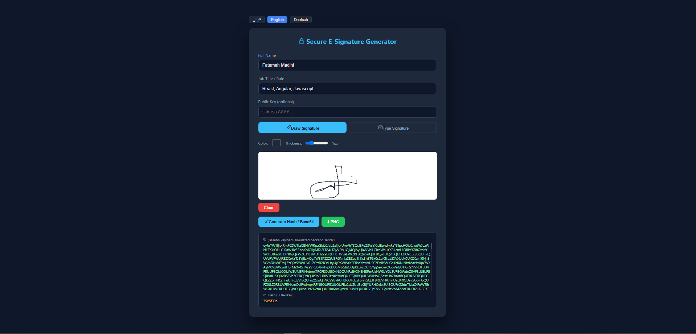

# Secure E-Signature Generator

A browser-based electronic signature tool built with React + TypeScript.  
Sign documents using a canvas (draw) or typed signature, then export a SHA-256 hash for verification.

[](https://secure-e-signature-generator.vercel.app/)
[](LICENSE)

<!-- جایگاه قرارگیری اسکرین‌شات یا گیف دمو -->
<!--  -->

## 🔗 Live Demo

You can try the live application here: [https://secure-e-signature-generator.vercel.app/](https://secure-e-signature-generator.vercel.app/)

<p align="center">
  
</p>


## Features

- ✍️ Draw or type your signature
- 🔐 SHA-256 hash generation (Base64 output)
- 🌐 Multi-language support: Persian (RTL), English, German
- 🎨 Dark theme UI with Tailwind CSS + MUI

## Tech Stack

React · TypeScript · Vite · Tailwind CSS · MUI · Lucide Icons

## Getting Started
```bash
npm install
npm run dev

## Usage

1. Choose signature mode (Draw / Type)
2. Sign in the canvas or input field
3. Click **Generate Hash** to get your SHA-256 signature hash
4. Copy the Base64 output for verification

## License

MIT


---
